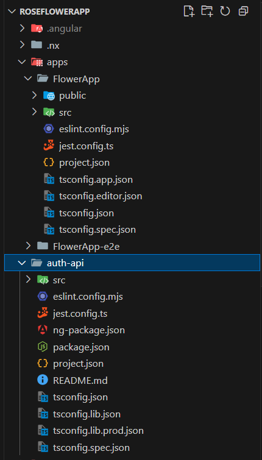

# RoseFlowerApp

Angular19 , PrimeNg , PrimeFlexCss , PrimeIcons

RoseFlowerApp is a monorepo containing multiple Angular applications and libraries.  
It is designed for scalability, modularity, and easy documentation using **Compodoc**.

# FlowerApp

E-commerce Application

## 📂 Project Structure



## 🔧 Setup & Installation

1. Clone the repository:
   ```bash
   git clone https://github.com/emanawad14/RoseFlowerApp.git
   cd RoseFlowerApp
   ```
2. Install dependencies:

```bash
npm i
```

3. Run development server (example for my-app):
   ```bash
   npm run start
   ```

## ⚡ Tech Stack

- [Angular 19](https://angular.dev)
- [Nx](https://nx.dev) (monorepo management)
- [Compodoc](https://compodoc.app) (documentation)
- [TypeScript](https://www.typescriptlang.org/)
- [Jest](https://jestjs.io/) (unit testing)
- [ESLint](https://eslint.org/) (linting)

## Documentaion

```bash
npm run doc
```

```

```
